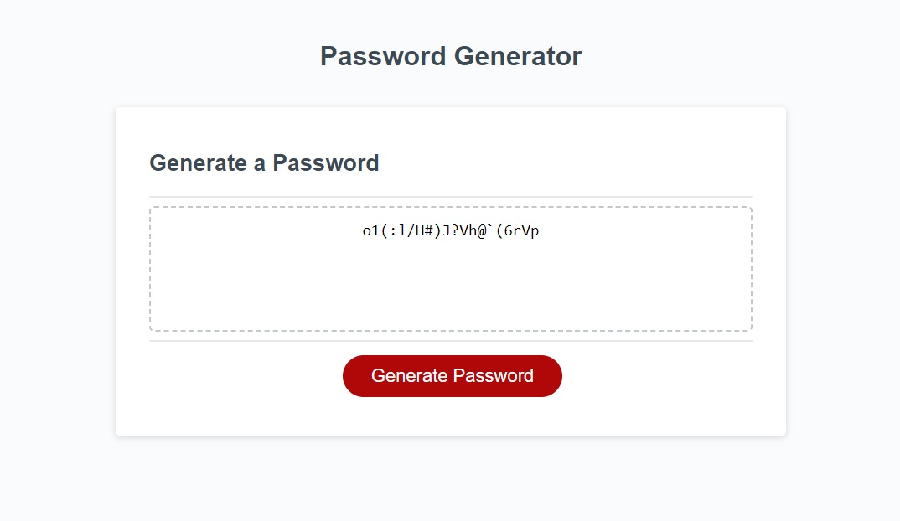

# m3-password-generator
A random password generator based on criteria selected by the user. The user can choose the password length, and whether it will include the following character sets: lowercase letters, uppercase letters, numbers, or special characters.

User must push the "generate pasword" button to start the process.

If the user chooses to cancel instead of inputting a character length the process will stop.

If the user inputs an invalid character length they will be alerted and prompted again.

If the user doesn't choose any criteria they will be alerted and prompted again.

GitHub Repo: https://github.com/BenACooper/m3-password-generator

Deployed Project: https://benacooper.github.io/m3-password-generator/

